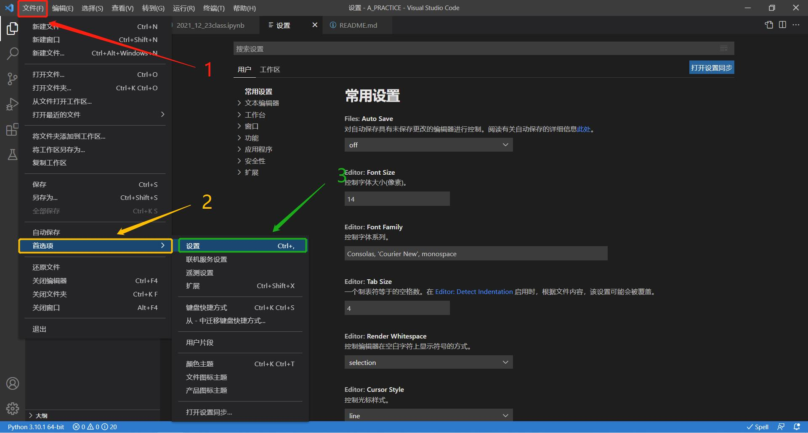

# Anaconde安装教程

## 第一步，下载Anaconde安装包

1、网址：https://www.anaconda.com/products/individual  

2、进入网站，页面如下  
<div  align="center">    

</div>  

3、下载Anaconde安装包。Windows系统用户直接点击图中 “Download” 即可，MacOS系统用户请点击 “苹果” 符号，下载合适版本号的安装包。如下图所示。  
<div  align="center">    

</div>  

4、请确认安装包的下载路径。下载路径不唯一，记清即可，如下图所示  
<div  align="center">    

</div>  


## 第二步，安装Anaconde

1、找到刚才下载好的安装包，双击打开，对话框如下图所示，点击 “Next”  
<div  align="center">    

</div>  

2、如下图，点击 “I Agree”  
<div  align="center">    

</div>  

3、如下图，选择 “Just Me (recommended)” ，点击 “Next”  
<div  align="center">    

</div>  


4、选择安装路径，请注意Anaconde占用空间为3G，而且最好选择剩余空间为50G以上的磁盘安装。点击 “Next” 开始安装，如下图所示  
<div  align="center">    

</div>  


5、安装完成

# VS Code安装教程

## 第一步，下载VS Code安装包

1、网址：https://code.visualstudio.com/  

2、进入网站，页面如下  
<div  align="center">    

</div>  

3、下载VS Code安装包。Windows系统用户点击图中的 “Download for windows” 即可，MacOS系统用户请点击 “Download for windows” 右侧的下拉菜单，找到合适版本号的安装包下载。如下图所示。  
<div  align="center">    

</div>  

4、选择合适的下载路径下载安装包 

## 第二步，安装VS Code

1、点击刚刚下载好的安装包，对话框如下图，选择 “我同意此协议” ，点击 “下一步”  
<div  align="center">    

</div>  

2、如下图，第一项 “创建桌面快捷方式” 根据自己需求勾选，其他的不用变。点击 “下一步”继续安装  
<div  align="center">    

</div>  

3、点击 “安装” 即可  
<div  align="center">    

</div>  

## 第三步，VS Code插件安装

1、打开安装好的VS Code  
<div  align="center">    

</div>  

2、在屏幕左侧，有个图标是四个小方块，点击它  
<div  align="center">    

</div>  

3、在左上角对话框内输入 “Chinese”  
<div  align="center">    

</div>  

4、打开第一项插件 “Chinese (Simplified) (简体中文) Language Pack for Visual Studio Code” ，点击 “Install” ，如下图所示
<div  align="center">    

</div>  

5、下载完成后，右下角会跳出一个对话框，提示您需要重启VS Code。重启VS Code，完成汉化。  

6、按照安装汉化包的方法，安装 “Jupyter” 和 “Python” 两个插件包。如果您想体验原汁原味的VS Code，可以不安装汉化包，但是 “Jupyter” 和 “Python” 一定要装好。安装好的插件可以在左侧对话框 “已安装（原版是：Install）” 的下拉菜单里进行管理，如下图所示
<div  align="center">    

</div>  

7、安装完成

# 在VS Code下搭建Anaconde环境时，可能遇到的两个问题及解决方法

并非所有人都会遇到以下问题，请您先进行Anaconde环境检测。若检测过程中程序没有报错，您可以无视之后的内容。

## 环境检测

1、打开VS code，点击“打开文件夹”。如下图所示
<div  align="center">    

</div>  

2、在任意路径新建一个文件夹，选中您新建的文件夹，点击“选择文件夹”，如下图所示
<div  align="center">    

</div>  

3、在如图位置，点击“新建文件”图标，新建一个文件，文件名为“XXX.ipynb”，其中XXX尽量是英文或者数字
<div  align="center">    

</div>  

4、点击右上角的“选择内核”，然后在屏幕顶部跳出的下拉菜单中选择“base Python 3.9.7”
<div  align="center">    

</div>  
<div  align="center">    

</div>  

5、如下图，输入代码  
`import numpy as np`
<div  align="center">    

</div>  

6、点击代码框左侧的小三角图标，运行程序。如果在代码框的左下角跳出绿色对钩，则说明Anaconde的环境已经搭建完成，可以正常使用，完成安装
<div  align="center">    

</div>  

## 问题一：错误代码“Bad file descriptor”
创建.ipynb文件不久之后，或者运行代码之后可能出现如下报错
<div  align="center">    

</div>  
问题原因：安装jupyter notebook时，会自动安装ipykernel, 如果pyzmq的版本过高，会导致报错  

解决方法：进入Anaconda prompt环境，输入以下命令，更换版本  
 1、鼠标右键点击“Windows”图标，点击“运行”，输入“cmd”，如下图所示
<div  align="center">    

</div>  
2、输入代码
```
pip uninstall pyzmq

 
pip install pyzmq==19.0.2
```

## 问题二：错误代码“ModuleNotFoundError”
问题原因：Anaconde环境变量未添加  
解决方法：  
 1、控制面板 → 系统与安全 → 系统
 2、在系统对话框进行如图所示的操作。其中第四步要添加3个路径，这个路径根据自己的情况而定，不需要和图中完全一致
<div  align="center">    

</div>  

3、找到Anaconda里面的python可执行程序，python.exe的路径。这个东西一般就在Anaconde的根目录里面
<div  align="center">    

</div>  

4、进入VS code的设置页面，如下图所示
<div  align="center">    

</div>  

5、在设置页面的顶部有一个搜索栏，在里面输入“python.pythonPath”，然后将Anaconda里面的python可执行程序添加到路径
<div  align="center">    

</div>  

6、重启VS code

7、输入如下代码，如果程序没有报错则说明问题解决
```python
import numpy as np

A = np.array([[1, 2], [3, 4]])
B = np.array([[5, 6], [7, 8]])

a = A.shape[0]
b = B.shape[1]
C = np.dot(A, B)

C
```
<div  align="center">    

</div>  